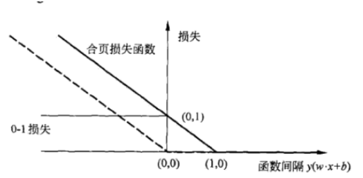
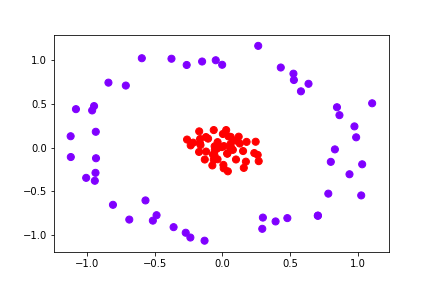
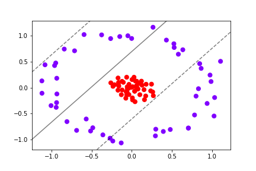
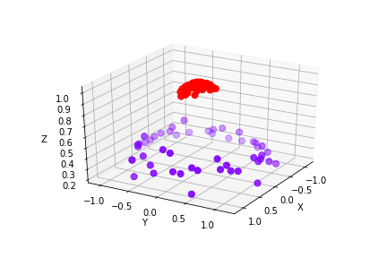
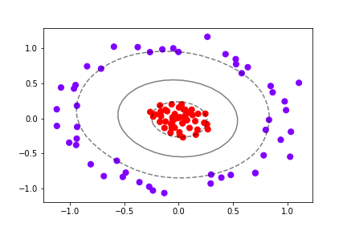
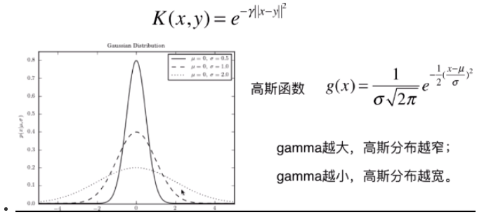
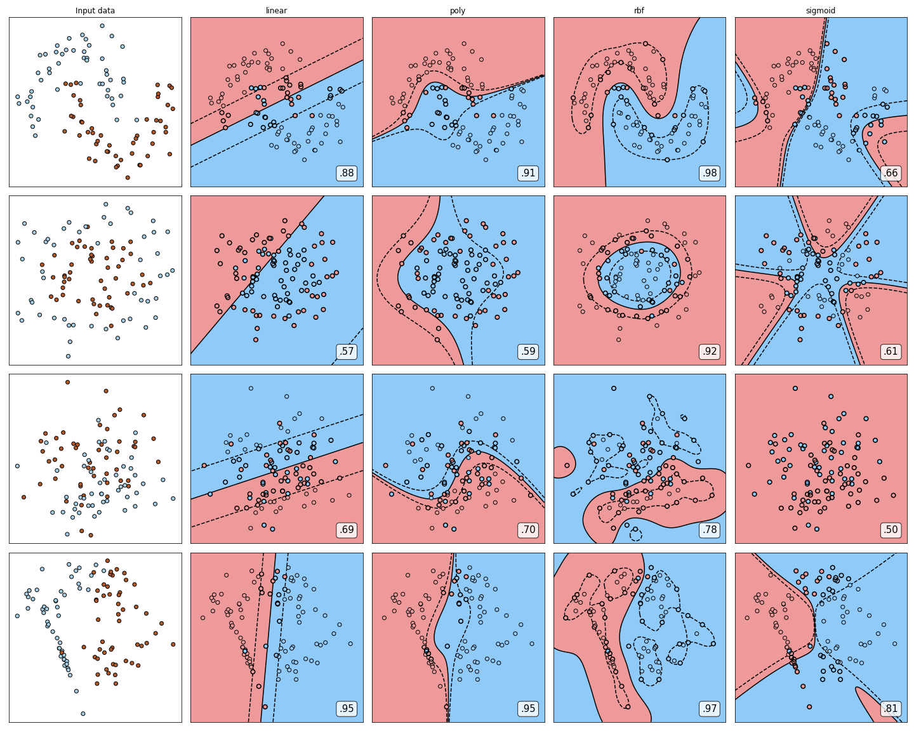
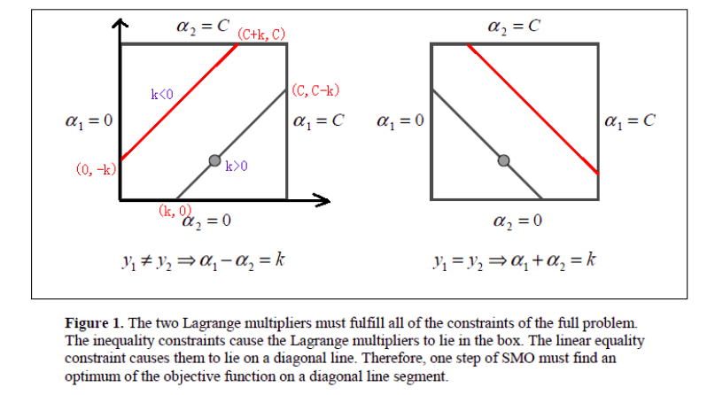

## 支持向量机

## 前言

​	　支持向量机是一种二分类的模型，它的基本模型是定义在特征空间上间隔最大的线性分类器，间隔最大使它有别与其他感知机模型。有**线性支持向量机**，**线性可分支持向量机**和**非线性支持向量机**。

##  线性可分支持向量机(Hard Margin)

###  函数间隔和几何间隔

#### 函数间隔

对于给定数据集$T$和超平面$(w,b)$，定义超平面$(w,b)$关于样本点$(x_i,y_i)$的函数间隔为
$$
\hat \gamma_i=y_i(w\cdot x_i+b)
$$
定义超平面$(w,b)$关于训练数据集$T$的函数间隔为超平面$(w,b)$关于$T$中所有样本点$(x_i,y_i)$的函数间隔之最小值，即
$$
\hat \gamma=\min_{i=1,\cdots,N}\hat\gamma_i
$$
函数间隔可以表示分类预测的**正确性**及**确信度**。

#### 几何间隔

$$
r=\frac{label(w^Tx+b)}{||w||_2}
$$

当数据被正确分类时，几何间隔就是点到超平面的距离为了求几何间隔最大，SVM基本问题可以转化为求解:($\frac{r^*}{||w||}$为几何间隔，(${r^*}$为函数间隔)
$$
\max\ \frac{r^*}{||w||}
$$

### 原理

支持向量机最简单的情况是线性可分支持向量机，或硬间隔支持向量机。构建它的条件是训练数据线性可分。其学习策略是最大间隔法。可以表示为凸二次规划问题，其原始最优化问题为

$$
\min _{w, b} \frac{1}{2}\|w\|^{2}
$$

$$
s.t. \quad y_{i}\left(w \cdot x_{i}+b\right)-1 \geqslant 0, \quad i=1,2, \cdots, N
$$

求得最优化问题的解为$w^*$，$b^*$，得到线性可分支持向量机，分离超平面是
$$
w^{*} \cdot x+b^{*}=0
$$
分类决策函数是

$$
f(x)=\operatorname{sign}\left(w^{*} \cdot x+b^{*}\right)
$$
最大间隔法中，函数间隔与几何间隔是重要的概念。

线性可分支持向量机的最优解存在且唯一。位于间隔边界上的实例点为支持向量。最优分离超平面由支持向量完全决定。
二次规划问题的对偶问题是
$$
\min \frac{1}{2} \sum_{i=1}^{N} \sum_{j=1}^{N} \alpha_{i} \alpha_{j} y_{i} y_{j}\left(x_{i} \cdot x_{j}\right)-\sum_{i=1}^{N} \alpha_{i}
$$

$$
s.t. \quad \sum_{i=1}^{N} \alpha_{i} y_{i}=0
$$

$$
\alpha_{i} \geqslant 0, \quad i=1,2, \cdots, N
$$

通常，通过求解对偶问题学习线性可分支持向量机，即首先求解对偶问题的最优值$a^*$，然后求最优值$w^*$和$b^*$，得出分离超平面和分类决策函数。		

## 线性近似可分（Soft Margin）

### 原理

​		现实中训练数据是线性可分的情形较少，训练数据往往是近似线性可分的，这时使用线性支持向量机，或软间隔支持向量机。线性支持向量机是最基本的支持向量机。

对于噪声或例外，通过引入松弛变量$\xi_{\mathrm{i}}$，使其“**可分**”，得到线性支持向量机学习的凸二次规划问题，其原始最优化问题是

$$
\min _{w, b, \xi} \frac{1}{2}\|w\|^{2}+C \sum_{i=1}^{N} \xi_{i}
$$

$$
s.t. \quad y_{i}\left(w \cdot x_{i}+b\right) \geqslant 1-\xi_{i}, \quad i=1,2, \cdots, N
$$

$$
\xi_{i} \geqslant 0, \quad i=1,2, \cdots, N
$$

求解原始最优化问题的解$w^*$和$b^*$，得到线性支持向量机，其分离超平面为
$$
w^{*} \cdot x+b^{*}=0
$$
分类决策函数为

$$
f(x)=\operatorname{sign}\left(w^{*} \cdot x+b^{*}\right)
$$
线性可分支持向量机的解$w^*$唯一但$b^*$不唯一。对偶问题是

$$
\min _{\alpha} \frac{1}{2} \sum_{i=1}^{N} \sum_{j=1}^{N} \alpha_{i} \alpha_{j} y_{i} y_{j}\left(x_{i} \cdot x_{j}\right)-\sum_{i=1}^{N} \alpha_{i}
$$

$$
s.t. \quad \sum_{i=1}^{N} \alpha_{i} y_{i}=0
$$

$$
0 \leqslant \alpha_{i} \leqslant C, \quad i=1,2, \cdots, N
$$

​		线性支持向量机的对偶学习算法，首先求解对偶问题得到最优解$\alpha^*$，然后求原始问题最优解$w^*$和$b^*$，得出分离超平面和分类决策函数。

​		对偶问题的解$\alpha^*$中满$\alpha_{i}^{*}>0$的实例点$x_i$称为支持向量。支持向量可在间隔边界上，也可在间隔边界与分离超平面之间，或者在分离超平面误分一侧。最优分离超平面由支持向量完全决定。

### 合页损失

​		线性支持向量机(软间隔)学习等价于最小化二阶范数正则化的合页函数，也即经验风险＋正则化项（其中C>0）：
$$
\min _{\boldsymbol{w}, b} \sum_{n=1}^{N} \max \left(0,1-y^{(n)}\left(\boldsymbol{w}^{\top} \boldsymbol{x}^{(n)}+b\right)\right)+\frac{1}{2 C}\|\boldsymbol{w}\|^{2}
$$
​		其中，第一项又称合页损失，其函数图像如下图，合页损失要求不仅要分类正确，而且确信度做够高时损失才为0.也就是说合页损失函数对学习有更高的要求．



##  非线性支持向量机（核技巧）

### 问题引入

​		下图中对一个对二维特征的数据进行可视化，左图中可以看出此时的数据呈现非线性，此时，我们对原始数据绘制了右图线性SVM的决策边界，可以明显的观察到线性**SVM**对非线性的数据的分类效果极差．但是，其实从数据分布的情况可以看出，存在一条非线性的环形边界，可以使的数据明显分开．

|  |  |
| :--------------------: | :----------------------------: |
|      原始数据分布      |          线性决策边界          |

​		然而，当我们把原始数据进行维度映射，如下如图所示，此时我们可以明显的发现在此时可以有一个线性超平面将数据分为两类，并且可能具有准确度较高．所以我们想是否在**SVM**存在一种映射使得我们的数据在另一个空间线性可分．而我们此时采用的方法为核技巧．



### 核函数

​		对于输入空间中的非线性分类问题，可以通过非线性变换将它转化为某个高维特征空间中的线性分类问题，**在高维特征空间中学习线性支持向量机**。由于在线性支持向量机学习的对偶问题里，目标函数和分类决策函数都只涉及实例与实例之间的内积，所以不需要显式地指定非线性变换，而是用核函数来替换当中的内积。<u>**核函数表示，通过一个非线性转换后的两个实例间的内积**</u>。具体地，$K(x,z)$是一个核函数，或正定核，意味着存在一个从输入空间x到特征空间的映射$\mathcal{X} \rightarrow \mathcal{H}$，对任意$\mathcal{X}$，有
$$
K(x, z)=\phi(x) \cdot \phi(z)
$$
对称函数$K(x,z)$为正定核的充要条件如下：对任意$$\mathrm{x}_{\mathrm{i}} \in \mathcal{X}, \quad \mathrm{i}=1,2, \ldots, \mathrm{m}$$，任意正整数$m$，对称函数$K(x,z)$对应的Gram矩阵是半正定的。

所以，在线性支持向量机学习的对偶问题中，用核函数$K(x,z)$替代内积，求解得到的就是非线性支持向量机
$$
f(x)=\operatorname{sign}\left(\sum_{i=1}^{N} \alpha_{i}^{*} y_{i} K\left(x, x_{i}\right)+b^{*}\right)
$$
使用核函数的优点;

- 不需要每一次都具体计算出原始样本点映射的新的无穷维度的样本点，直接使用映射后的新的样本点的点乘计算公式即可

- 减少计算量  

- 较少存储空间

下图是使用＂**rbf**＂高斯核函数，将数据在高维映射进行线性分类的结果，由图中可以看出，此时的决策边界可以轻易的两类数据分开.



### 探析高斯核$\gamma$参数

#### 核函数公式



#### 参数对比

| .png) | .png) |
| :----------------------------------: | :----------------------------------: |
|              过度欠拟合              |                欠拟合                |
|  .png)  | .png) |
|              just right              |                过拟合                |

　　从上图中可以观察到，在高斯核中, 我们$\gamma$参数的数值可以在一定程度影响数据的拟合程度，上图中当参数值较小时，此时出现欠拟合，而随着参数值的增大，数据的拟合程度越来好，但是参数值大到一定程度，则会出现过拟合现象．所以，有时候我们在使用RBF核函数时，可以调节$\gamma$值来调节模型的拟合程度，增加模型的泛化能力．

### 不同核函数的性能

​		下图是不同类型的数据集在不同核函数的决策边界的可视化，由图中的评测分数可知，高斯核函数无论是在线性还是非线性数据都有较好的性能，而sigmoid核函数总体上性能较差，所以，当数据的分布不能确定时，可以首先尝试一下rbf核函数．除此之外，下图中也绘制了＂支持向量＂（黑色边界圆点），数据中＂支持向量＂的点位于虚线超平面，虚线超平面的中间和分错的点．



## SMO算法

​		无论是基于Soft Margin还是Hard Margin的支持向量都会通过求解对偶函数来得到模型的参数，只是两种方法最后的约束条件不一致，不失一般性，下面是线性近似可分的对偶函数，现在主要针对其中的系数$\alpha_{i}$进行求解．所以，SMO算法就是要解如下的凸二次规划的对偶问题：
$$
\min _{\alpha} \frac{1}{2} \sum_{i=1}^{N} \sum_{j=1}^{N} \alpha_{i} \alpha_{j} y_{i} y_{j}\left(x_{i} \cdot x_{j}\right)-\sum_{i=1}^{N} \alpha_{i}
$$

$$
s.t. \quad \sum_{i=1}^{N} \alpha_{i} y_{i}=0
$$

$$
0 \leqslant \alpha_{i} \leqslant C, \quad i=1,2, \cdots, N
$$


### 1.加载数据


```python
def loadDataset(filename):
    dataMat = []
    yMat = []
    fr = open(filename)
    for line in fr.readlines():
        line = line.strip().split(",")
        dataMat.append([float(line[0]),float(line[1]),float(line[2]), float(line[3])])
        yMat.append(float(line[4]))
    return dataMat, yMat
```

### 2. 存储全局变量


```python
class diyStruct:
    def __init__(self, dataMat, yMat, C, toler, kernelParam):
        self.dataMat = dataMat
        self.yMat = yMat
        self.C = C
        self.toler = toler #精确误差度
        self.m = shape(dataMat)[0] # 样本数目
        self.E = mat(zeros((self.m, 2))) # 误差项
        self.alphas = mat(zeros((self.m , 1))) # 拉格朗日系数
        self.b = 0
        self.K = mat(zeros((self.m, self.m))) # 核函数
        for i  in range(self.m):
            self.K[:, i] = transfer2Kernel(self.dataMat, self.dataMat[i, :], kernelParam)
```

### 3.核函数


```python
def transfer2Kernel(X, Xi, kernelParam):
    m = shape(X)[0]
    Ktemp = mat(zeros((m, 1)))
    
    if kernelParam[0] == "rbf":
        for i in range(m):
            xdelta = X[i, :] - Xi
            # 第二范式
            Ktemp[i] = xdelta * xdelta.T
        Ktemp = exp(-Ktemp/kernelParam[1]**2)
    else:raise NameError("underfined kernel name!")
    return Ktemp
```

### 4.拉格朗日系数裁剪

​		由于，在进行SMO算法计算$\alpha_{1}, \alpha_{2} $时，未进行对参数的约束，所以，需要对未裁剪的参数进行约束使得参数值满足约束条件．由于此时SMO算法两个变量的最优化问题实质上可以转变为单变量的最优化问题，所以，不妨考虑为单变量的$\alpha_{2}$的优化问题．下图是约束条件：



以下公式是对上图中$\alpha_{2}$参数进行单变量约束的结果：
$$
\begin{array}{l}y_{1} \neq y_{2} , L=\max \left(0, \alpha_{2}^{\text {old }}-\alpha_{1}^{\text {old }}\right) ; H=\min \left(C, C+\alpha_{2}^{\text {old }}-\alpha_{1}^{\text {old }}\right) \\  y_{1}=y_{2} , L=\max \left(0, \alpha_{1}^{\text {old }}+\alpha_{2}^{\text {old }}-C\right) ; H=\min \left(C, \alpha_{2}^{\text {old }}+\alpha_{1}^{\text {old }}\right)\end{array}
$$
所以最终的约束条件如下：
$$
\alpha_{2}^{\text {new}}=\left\{\begin{array}{l}\mathrm{H}, \alpha_{2}^{\text {new, unclipped }}>H \\ \alpha_{2}^{\text {new, unclipped }}, L \leqslant \alpha_{2}^{\text {new unclipped }} \leqslant H \\ \text { L }, \alpha_{2}^{\text {new, unclipped }}<L\end{array}\right.
$$


```python
def clipAlpha(alphaJ, L, H):
    if(alphaJ < L):
        alphaJ = L
    if(alphaJ > H):
        alphaJ = H

    return alphaJ
```

### 5.裁剪系数b

​		对于系数的最终选择考虑，如果此时求解的$a_{1}^{new}, a_{2}^{new}$同时满足条件$0<a_{i}^{new}, i = 1, 2$, 那么$b_{1}^{new}=b_{2}^{new}$．如果$a_{1}^{new}和a_{２}^{new}$是０或者C,那么$b_{1}^{new}　和　b_{2}^{new}$以及它们之间符合KKT条件的阀值，这时选择它们的中点作为$b^{new}$.


```python
def calcb(b1new, b2new):
    b = b1new
    if (b1new != b2new):
        b = (b1new + b2new) / 2
    return b
```

### 6.计算误差项


```python
def calcE(alphaI, diyObj):
    
    yI = float(diyObj.yMat[alphaI])
    gxI = float(multiply(diyObj.alphas, diyObj.yMat).T * diyObj.K[:, alphaI]
               + diyObj.b)
    EI = gxI - yI
    return EI
```

### 7.选择系数$\alpha_{1}, \alpha_{2}$


```python
def selectJ(EI, alphaI, diyObj):
    # 第一列索引值表示是否存贮相应的误差项
    nonzeroEIndex = nonzero(diyObj.E[:, 0].A)[0]
    alphaJ = 0
    EJ = 0
    maxDelta = 1
    
    # 第二个变量的选择
    if len(nonzeroEIndex) > 1:
        for j in nonzeroEIndex:
            # 选择不同与I节点的值
            if alphaI == j :continue 
            EJtemp = calcE(j, diyObj)
            deltaE = abs(EI - EJtemp)
            # 选择最大变化的
            if (deltaE > maxDelta):
                maxDelta = deltaE
                alphaJ = j
                EJ = EJtemp
    else:
        alphaJ = alphaI
        while(alphaJ == alphaI):
            alphaJ =int(random.uniform(0, diyObj.m))
        EJ = calcE(alphaJ, diyObj)
    
    return alphaJ, EJ

```

### 8.迭代更新参数


```python
def iterL(alphaI, diyObj):
    # 计算系数值
    yI = diyObj.yMat[alphaI]
    EI = calcE(alphaI, diyObj)
    diyObj.E[alphaI] = [1, EI]
    
    #第一个变量的选择(违反KKT条件)
    if((yI * EI > diyObj.toler and diyObj.alphas[alphaI] > 0) or
            (yI * EI < - diyObj.toler and diyObj.alphas[alphaI] < diyObj.C)):
        # 得到第二个变量
        alphaJ, EJ = selectJ(EI, alphaI, diyObj)
        yJ = diyObj.yMat[alphaJ]
        
        # old alpha
        alpha1old = diyObj.alphas[alphaI].copy()
        alpha2old = diyObj.alphas[alphaJ].copy()
        
        # 计算eta 
        eta = diyObj.K[alphaI, alphaI] + diyObj.K[alphaJ, alphaJ] \
        - 2 * diyObj.K[alphaI, alphaJ]
        if eta <= 0: return 0
        
        # 裁剪alpha2
        alpha2newUnclip = alpha2old + yJ*(EI - EJ)/eta
        if (yI == yJ):
            L = max(0, alpha1old + alpha2old -diyObj.C)
            H = min(diyObj.C, alpha2old+alpha1old)
        else:
            L = max(0, alpha2old - alpha1old)
            H = min(diyObj.C, diyObj.C - alpha1old + alpha2old)
        if L==H: return 0
        
        alpha2new = clipAlpha(alpha2newUnclip, L, H)
        
        # 精度满足条件(停止条件)
        if abs(alpha2new - alpha2old) < 0.00001: return 0
        # 更新alpha1的值
        alpha1new = alpha1old + yI * yJ * (alpha2old - alpha2new)
        
        # 更新b的值(每一次新的参数确定后)
        b1new = - EI - yI * diyObj.K[alphaI,alphaI] * (alpha1new - alpha1old) \
                - yJ * diyObj.K[alphaJ, alphaI] * (alpha2new - alpha2old) \
                + diyObj.b
        b2new = - EJ - yI * diyObj.K[alphaI,alphaJ] * (alpha1new - alpha1old) \
                - yJ * diyObj.K[alphaJ, alphaJ] * (alpha2new - alpha2old) \
                + diyObj.b
        # 真正的b值
        b = calcb(b1new, b2new)
        
        # 存储值
        diyObj.alphas[alphaI] = alpha1new
        diyObj.alphas[alphaJ] = alpha2new
        diyObj.b = b
        
        #变量优化后需要再次更新E值
        diyObj.E[alphaI] = [1, calcE(alphaI, diyObj)]
        diyObj.E[alphaJ] = [1, calcE(alphaJ, diyObj)]
        return 1
    else: return 0

```

### 9. SMO

​		第一个变量的选择称为外循环，首先遍历整个样本集，选择违反KKT条件的αi作为第一个变量．违反KKT条件公式如下（注意此时加入精确度  $\varepsilon$ ）
$$
\text { volators : } \quad\left(\alpha_{i}<C \Rightarrow y_{i} E_{i}<-\varepsilon\right) \quad \text { or } \quad\left(\alpha_{i}>0 \Rightarrow y_{i} E_{i}>\varepsilon\right)
$$
​		接着依据相关规则选择第二个变量(见下面分析),对这两个变量采用上述方法进行优化。**当遍历完整个样本集后**，遍历非边界样本集(0<αi<C)中违反KKT的αi作为第一个变量，同样依据相关规则选择第二个变量，对此两个变量进行优化。**当遍历完非边界样本集后，再次回到遍历整个样本集中寻找，即在整个样本集与非边界样本集上来回切换，寻找违反KKT条件的αi作为第一个变量。直到遍历整个样本集后，没有违反KKT条件αi，然后退出**。边界上的样本对应的αi=0或者αi=C，在优化过程中很难变化，然而非边界样本0<αi<C会随着对其他变量的优化会有大的变化.

注意，根据KKT条件：

- 当$ai＝０$,此时的点位于虚线超平面的外侧或者在虚线超平面上，能正确分类
- 当$0<ai<C$,此时对应的样本点位于间隔边界上，能正确分类
- 当$ai = C$，此时对应的样本点位于间隔边界或间隔边界的内侧，根据松弛系数$\varepsilon_{i}$确定


```python
def smo(dataMat, yMat, C, toler, iterNum, kernelParam):
    diyObj = diyStruct(mat(dataMat), mat(yMat).transpose(), C, toler, kernelParam)
    currentToler = 0
    changedAlphas = 0 # 记录此时的alpha对数
    allSet = True
    # 每次选择两个alpha值进行优化
    while((currentToler < iterNum and changedAlphas >0)) or (allSet):
        changedAlphas = 0
        if allSet:
            for i in range(diyObj.m):
                changedAlphas += iterL(i, diyObj)
                
#                 print("iter:%d i:%d,pairs changed %d"
#                       %(currentToler, i, changedAlphas))
            allSet = False
        else:
            #　遍历只符合 ０＜ai＜C 的alpha(在虚线超平面上的点)(non_bound)
            alphaIs = nonzero((diyObj.alphas.A > 0) * (diyObj.alphas.A < C))[0] 
            for i in alphaIs:
                changedAlphas += iterL(i, diyObj)
#                 print("iter:%d i:%d,pairs changed %d"
#                       %(currentToler, i, changedAlphas))
            if changedAlphas == 0:
                allSet = True
        # 记录迭代次数
        currentToler += 1
#         print("iteration number: %d" % currentToler)
    return diyObj.alphas, diyObj.b

```

### 10.测试SVM

#### 源代码


```python
#测试机的真实结果: 1,1,1,-1,-1,-1,-1,1,1,-1
def testSVM():
    result = []
    dataMat, yMat=loadDataset("data/bloodTransfusion_noduplicated.txt")
    alphas, b = smo(dataMat, yMat, 200, 0.0001, 100, ("rbf", 20))
    testData = [[2,50,12500,98],[0,13,3250,28],[1,16,4000,35],[1,24,6000,77],[4,4,1000,4]
        ,[1,12,3000,35],[4,23,5750,58],[2,7,1750,14],[2,10,2500,28],[1,13,3250,47]]
    m, n = shape(testData)
    testmat = mat(testData)
    for i in range(m):
        kernelEval = transfer2Kernel(mat(dataMat), testmat[i, :], ("rbf", 20))
        predict = kernelEval.T*multiply(mat(yMat).transpose(), alphas) + b
        result.append((sign(predict)))
    print("预测结果", result)
testSVM()
```

    预测结果 [matrix([[1.]]), matrix([[1.]]), matrix([[-1.]]), matrix([[-1.]]), matrix([[-1.]]), matrix([[-1.]]), matrix([[-1.]]), matrix([[-1.]]), matrix([[1.]]), matrix([[-1.]])]

#### 使用Sklearn验证

```python
from sklearn.svm import SVC
dataMat = []
yMat = []
fr = open("data/bloodTransfusion_noduplicated.txt")# 真实数据
for line in fr.readlines():
    line = line.strip().split(",")
    dataMat.append([float(line[0]),float(line[1]),float(line[2]), float(line[3])])
    yMat.append(float(line[4]))
Xtrain = mat(dataMat)
Ytain = mat(yMat)
testData = [[2,50,12500,98],[0,13,3250,28],[1,16,4000,35],[1,24,6000,77],
            [4,4,1000,4],[1,12,3000,35],[4,23,5750,58],[2,7,1750,14],
            [2,10,2500,28],[1,13,3250,47]]
```


```python
clf = SVC(gamma=20, tol=0.0001) # 默认使用rbf
clf.fit(dataMat, yMat)
clf.predict(testData)
```


    array([ 1.,  1.,  1., -1., -1., -1., -1.,  1.,  1., -1.])

​		由上可见，两者预测结果相等，且都为真实数据．


## 参考

[支持向量机的原理和实现](https://www.ibm.com/developerworks/cn/analytics/library/machine-learning-hands-on1-svn/index.html?ca=drs-)

[机器学习算法实践-SVM中的SMO算法](https://zhuanlan.zhihu.com/p/29212107)

[支持向量机（五）SMO算法](https://www.cnblogs.com/jerrylead/archive/2011/03/18/1988419.html)

[支持向量机通俗导论](https://blog.csdn.net/v_JULY_v/article/details/7624837)

[机器学习：svm](https://www.cnblogs.com/volcao/p/9465214.html)

[【机器学习详解】SMO算法剖析](https://blog.csdn.net/luoshixian099/article/details/51227754)

[[支持向量机的序列最小最优化算法SMO实现](https://zhiyuanliplus.github.io/SVM-SMO)](https://zhiyuanliplus.github.io/SVM-SMO)

[支持向量机原理详解(六): 序列最小最优化(SMO)算法(Part I)](https://zhuanlan.zhihu.com/p/64580199)