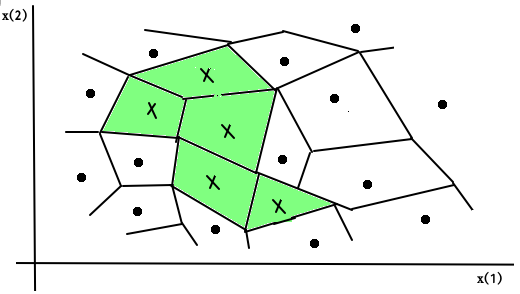
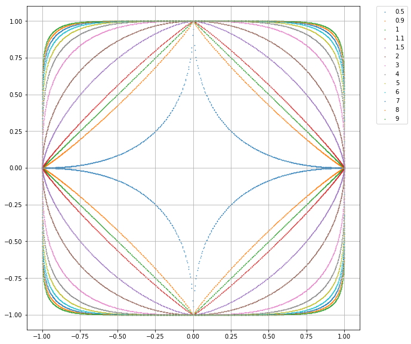
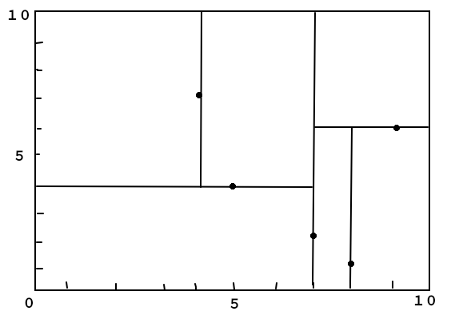
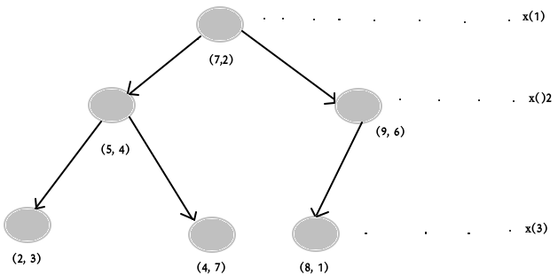
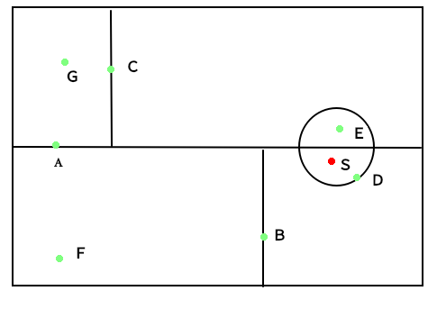

## 前言

>**目的：**$k$近邻法是基本且简单的分类与回归方法。$k$近邻法的基本做法是：对给定的训练实例点和输入实例点，首先确定输入实例点的$k$个最近邻训练实例点，然后利用这$k$个训练实例点的类的多数来预测输入实例点的类。

### 1. k 近邻模型

1.1  **算法**

   输入: $T=\{(x_1,y_1),(x_2,y_2),\dots,(x_N,y_N)\}， x_i\in \cal{X}\sube{\bf{R}^n}, y_i\in\cal{Y}=\{c_1,c_2,\dots, c_k\}$; 实例特征向量$x$

   输出: 实例所属的$y$

   步骤:

   1. 根据指定的**距离度量**，在$T$中查找$x$的**最近邻的$k$个点**，覆盖这$k$个点的$x$的邻域定义为$N_k(x)$

   2. 在$N_k(x)$中应用**分类决策规则**决定$x$的类别$y$
      $$
      y=\arg\max_{c_j}\sum_{x_i\in N_k(x)}I(y_i=c_j), i=1,2,\dots,N, j=1,2,\dots,K
      $$

   这里提到了$k$近邻模型的三要素，如算法描述中黑体标注的部分， 注意这里的三要素和前面说的统计学习方法的三要素不是一个东西。

 1.2 **模型**

   

   ​															　　　　　特征空间划分图

   1.3  **距离度量**

   ​		特征空间中的两个实例点的距离是两个实例点相似度程度的反应，设特征空间$x$是$n$维实数向量空间 ，$x_{i}, x_{j} \in \mathcal{X}$,$x_{i}=\left(x_{i}^{(1)}, x_{i}^{(2)}, \cdots, x_{i}^{(n)}\right)^{\mathrm{T}}$,$x_{j}=\left(x_{j}^{(1)}, x_{j}^{(2)}, \cdots, x_{j}^{(n)}\right)^{\mathrm{T}}$，则：$x_i$,$x_j$的$L_p$距离定义为:

   $L_{p}\left(x_{i}, x_{j}\right)=\left(\sum_{i=1}^{n}\left|x_{i}^{(i)}-x_{j}^{(l)}\right|^{p}\right)^{\frac{1}{p}}$

   - $p= 1$  曼哈顿距离
   - $p= 2$  欧氏距离
   - $p= inf$   闵式距离minkowski_distance 



- **例题3.1:**

	>描述：已知二维空间的３个点$x_1 = (1, 1)^T, x_2 = (5, 1)^T, x3 = (4, 4)^T$,试求在$p$取得不同值时，$L_p$距离下的$x_1$的最近邻点。

```python
#1.计算欧式距离
import math 
from itertools import combinations

def L(x, y, p=2):
    if len(x) == len(y) and len(y) > 1:
        sum = 0
        for i in range(len(x)):
            sum += math.pow(abs(x[i]-y[i]), p)
        
        return math.pow(sum , 1/p)
    else:
        return 0

#2. 数据准备
x1 = [1, 1]
x2 = [5, 1]
x3 = [4, 4]

#3.输入数据
for i in range(1, 5):
    r = {'1-{}'.format(c):L(x1, c, p = i) for c in [x2, x3]}#字典
    
    print(min(zip(r.values(), r.keys())))
    print(r,i)
    print("-"*10)
```

- **输出结果**

```markdown
p = 1,x1的最近邻点: (4.0, '[5, 1]')
p = 2,x1的最近邻点: (4.0, '[5, 1]')
p = 3,x1的最近邻点: (3.7797631496846193, '[4, 4]')
p = 4,x1的最近邻点: (3.5676213450081633, '[4, 4]')
```

### 2. 构建kd-tree

>**描述：**kd树是一种对k维空间中的实例点进行存储以便对其进行快速检索的树形数据结构。
>
>**算法描述**：
>
>输入：$k$维空间数据集$T＝\{x_1，x_2,…,x_N\}$，
>
>其中$x_{i}=\left(x_{i}^{(1)}, x_{i}^{(2)}, \cdots, x_{i}^{(k)}\right)^{\mathrm{T}}$ ，$i＝1,2,…,N$；
>
>输出：**kd**树。
>
>（1）开始：构造根结点，根结点对应于包含$T$的$k$维空间的超矩形区域。
>
>​	选择$x^{(1)}$为坐标轴，以T中所有实例的$x^{(1)}$坐标的中位数为切分点，将根结点对应的超矩形区域切分为两个子区域。切分由通过切分点并与坐标轴$x^{(1)}$垂直的超平面实现。
>
>由根结点生成深度为1的左、右子结点：左子结点对应坐标$x^{(1)}$小于切分点的子区域， 右子结点对应于坐标$x^{(1)}$大于切分点的子区域。
>
>将落在切分超平面上的实例点保存在根结点。
>
>（2）重复：对深度为$j$的结点，选择$x^{(1)}$为切分的坐标轴，$l＝j(modk)+1$，以该结点的区域中所有实例的$x^{(1)}$坐标的中位数为切分点，将该结点对应的超矩形区域切分为两个子区域。切分由通过切分点并与坐标轴$x^{(1)}$垂直的超平面实现。
>
>由该结点生成深度为$j+1$的左、右子结点：左子结点对应坐标$x^{(1)}$小于切分点的子区域，右子结点对应坐标$x^{(1)}$大于切分点的子区域。
>
>将落在切分超平面上的实例点保存在该结点。
>
>（3）直到两个子区域没有实例存在时停止。从而形成**kd**树的区域划分。

- **例3.2:**

> **问题描述：**给定一个二维空间的数据集：
> $$
> T = \{(2, 3)^T, (5, 4)^T, (9, 6)^T, (4, 7)^T, (8, 1)^T, (7, 2)^T\}
> $$
> 构造一个平衡kd树。

***代码:***

```python
# kd-tree 每个结点中主要包含的数据如下：
class KdNode(object):
    def __init__(self, dom_elt, split, left, right):
        self.dom_elt = dom_elt#结点的父结点
        self.split = split#划分结点
        self.left = left#做结点
        self.right = right#右结点

class KdTree(object):
    def __init__(self, data):
        k = len(data[0])#数据维度
        #print("创建结点")
        #print("开始执行创建结点函数！！！")
        def CreateNode(split, data_set):
            #print(split,data_set)
            if not data_set:#数据集为空
                return None
            #print("进入函数！！！")
            data_set.sort(key=lambda x:x[split])#开始找切分平面的维度
            #print("data_set:",data_set)
            split_pos = len(data_set)//2 #取得中位数点的坐标位置(求整)
            median = data_set[split_pos]
            split_next = (split+1) % k #(取余数)取得下一个节点的分离维数
            return KdNode(
                median,
                split,
                CreateNode(split_next, data_set[:split_pos]),#创建左结点
                CreateNode(split_next, data_set[split_pos+1:]))#创建右结点
        #print("结束创建结点函数！！！")
        self.root = CreateNode(0, data)#创建根结点
            
#KDTree的前序遍历
def preorder(root):
    print(root.dom_elt)
    if root.left:
        preorder(root.left)
    if root.right:
        preorder(root.right)
        
if __name__ == "__main__":
data = [[2,3],[5,4],[9,6],[4,7],[8,1],[7,2]]
kd = KdTree(data)
preorder(kd.root)
```

**输出结果:**

```python
[7, 2]
[5, 4]
[2, 3]
[4, 7]
[9, 6]
[8, 1]
```

**kd 树构建图**

|  |  |
| :-------------------------: | :-----------------: |
|        特征空间划分         |      kd树实例       |

### 3. 搜索kd树

> 算法描述：
>
> 输入：已构造的kd 树；目标点x;
>
> 输出：x 的最近邻
>
> （１）在kd树中找出包含目标点$x$的叶结点：
>
> （２）以此叶节点为'当前最近点'
>
> （３）递归向上回退，在每个节点进行以下操作：
>
> （a）如果该结点保存的实例点比当前最近点距离目标点更近，则以该实例点为'当前最近点'		
>
>    (b)   检查另一子结点对应的区域是否以目标点为球心，以目标点与'当前最近点'间的距离为半径的超球体相交。
>
> ​		如果相交，则在另一个子结点对应的区域存在距离目标点更近的点，移动到另一个子结点。接着，递归的进行最近邻搜索。
>
> ​		若不相交，则向上回退
>
> （４）当回退到根结点时，搜索结束，最后的‘当前最近点’即为x的最近邻点。

- **代码描述：**

```python
from math import sqrt
from collections import namedtuple
# 定义一个namedtuple,分别存放最近坐标点、最近距离和访问过的节点数
result = namedtuple("Result_tuple",
                    "nearest_point  nearest_dist  nodes_visited")

#搜索开始
def find_nearest(tree, point):
    k = len(point)#数据维度
    
    def travel(kd_node, target, max_dist):
        if kd_node is None:
            return result([0]*k, float("inf"), 0)#表示数据的无
        
        nodes_visited = 1
        s = kd_node.split #数据维度分隔
        pivot = kd_node.dom_elt #切分根节点
        
        if target[s] <= pivot[s]:
            nearer_node = kd_node.left #下一个左结点为树根结点
            further_node = kd_node.right #记录右节点
        else: #右面更近
            nearer_node = kd_node.right
            further_node = kd_node.left
        temp1 = travel(nearer_node, target, max_dist)
        
        nearest = temp1.nearest_point# 得到叶子结点，此时为nearest
        dist = temp1.nearest_dist #update distance
        
        nodes_visited += temp1.nodes_visited
        print("nodes_visited:", nodes_visited)
        if dist < max_dist:
            max_dist = dist
        
        temp_dist = abs(pivot[s]-target[s])#计算球体与分隔超平面的距离
        if max_dist < temp_dist:
            return result(nearest, dist, nodes_visited)
        # -------
        #计算分隔点的欧式距离
        
        temp_dist = sqrt(sum((p1-p2)**2 for p1, p2 in zip(pivot, target)))#计算目标点到邻近节点的Distance
        
        if temp_dist < dist:
            
            nearest = pivot #更新最近点
            dist = temp_dist #更新最近距离
            max_dist = dist #更新超球体的半径
            print("输出数据:" , nearest, dist, max_dist)
            
        # 检查另一个子结点对应的区域是否有更近的点
        temp2 = travel(further_node, target, max_dist)

        nodes_visited += temp2.nodes_visited
        if temp2.nearest_dist < dist:  # 如果另一个子结点内存在更近距离
            nearest = temp2.nearest_point  # 更新最近点
            dist = temp2.nearest_dist  # 更新最近距离

        return result(nearest, dist, nodes_visited)

    return travel(tree.root, point, float("inf"))  # 从根节点开始递归
if __name__ == "__main__":
data = [[2,3],[5,4],[9,6],[4,7],[8,1],[7,2]]
kd = KdTree(data)
preorder(kd.root)
ret = find_nearest(kd, [3, 4.5])
print(ret)

```

- **输出结果**

```
Result_tuple(nearest_point=[2, 3], nearest_dist=1.8027756377319946, nodes_visited=4)
```

- **例3.3**

>**描述：**如图所示的kd树，根结点为Ａ，　其子节点为Ｂ，C等，树上一个存储７个实例点；另有一个输入目标实例点S,求Ｓ的最近邻。



### ４.参考

[2 KD-Tree的构造与搜索](https://juejin.cn/post/6844904194487353357)