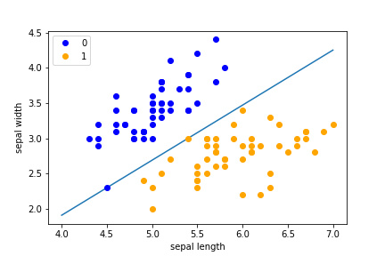

# 第二章　感知机模型

###　1.感知机学习算法

#### 1.1 概述

​		感知机模型是一个二分类的的线性模型，其输入为实例的特征向量，输出为实例的类别，取-1和+1二值。感知机对应输入空间（特征空间）中将实例划分为正负两类的分离超平面，属于判别模型。感知机模型如下（其中w和x为感知机模型参数）：
$$
\begin{array}{l}{f(x)=\operatorname{sign}(w \cdot x+b)} \\ {\operatorname{sign}(x)=\left\{\begin{array}{ll}{+1,} & {x \geqslant 0} \\ {-1,} & {x<0}\end{array}\right.}\end{array}
$$
​		感知机学习的策略是极小化损失函数，损失函数的得出是根据数据点中误分类的点到分离超平面的的距离，损失函数如下（其中Ｍ表示误分类点的个数）：
$$
\min _{w, b} L(w, b)=-\sum_{x_{i} \in M} y_{i}\left(w \cdot x_{i}+b\right)
$$
​		显然，这个损失函数的值是非负的，并且，当数据点中没有误分类的点时，这时的损失函数的值为０。感知机学习算法是误分类驱动的，具体采用随机梯度下降法，在实际极小化的过程中，不是将所有的误分类点进行梯度下降，而是一次选取一个误分类点使其梯度下降。梯度参数更新如下：
$$
\begin{array}{l}{w=w+\eta y_{i} x_{i}} \\ {b=b+\eta y_{i}}\end{array}
$$
​		这样通过更新损失函数的参数w和b,使得损失函数的值不断减少的０，最终得到相应的w和b参数值，进而得到分类超平面的$w \cdot x_{i}+b=0$。

#### 1.2 感知机学习算法的原始形式

​	**输入：$T=\{(x_1,y_1),(x_2,y_2),\dots,(x_N,y_N)\}\\ x_i\in \cal X=\bf R^n\mit , y_i\in \cal Y\it =\{-1,+1\}, i=1,2,\dots,N; \ \ 0<\eta\leqslant 1$**

​    **输出：$w,b;f(x)=sign(w\cdot x+b)$**

1. 选取初值$w_0,b_0$

2. 训练集中选取数据$(x_i,y_i)$（误分类点的个数）

3. 如果$y_i(w\cdot x_i+b)\leqslant 0$

$$
w\leftarrow w+\eta y_ix_i \nonumber\\
 b\leftarrow b+\eta y
$$

 4. 转至(2)，直至训练集中没有误分类点

　**算法的直观解释：**当一个实例点被误分类，即位于分离超平面的错误的一侧时，则调整w, b的值，使得分离超平面的向该误分类点的一侧移动，以减少该分类点与超平面的距离，直到超平面越过该分类点的使其正确被分类。

**代码实现：**

```python
#1.数据预处理
data = np.array(df.iloc[:100, [0, 1, -1]])
print(data.shape)
X, y = data[:,:-1], data[:,-1]#取出数据和标签
y = np.array([1 if i == 1 else -1 for i in y])#剔除零元素为-1

#2.感知机算法
class Model:
    
    def __init__(self):
        self.w = np.ones(len(data[0])-1, dtype=np.float32)
        self.b = 0
        self.l_rate = 0.1
    
    #构建函数
    def sign(self, x, w, b):
        y = np.dot(x, w) + b
        return y
    
    #随机梯度下降算法的构建
    def fit(self, X_train, y_train):
        is_wrong = False
        while not is_wrong:
            wrong_count = 0 #误分类点个数
            for d in range(len(X_train)):#遍历整个数据点
                X = X_train[d]
                y = y_train[d]
                #判断是否为误分类点
                if y * self.sign(X, self.w, self.b) <= 0:
                    #梯度下降法更新数据
                    self.w = self.w + self.l_rate*np.dot(y, X)
                    self.b = self.b + self.l_rate*y
                    wrong_count += 1
                    
            if wrong_count == 0: #数据能够正确的分类，没有误分类的点
                    is_wrong = True
        print(wrong_count)
        return 'Perceptron Model!'
            
            
    def score(self):
        pass
        
#3.数据处理
perceptron = Model()
perceptron.fit(X, y)
x_points = np.linspace(4, 7,10)
y_ = -(perceptron.w[0]*x_points + perceptron.b)/perceptron.w[1]
#绘画分类线段
plt.plot(x_points, y_)
plt.plot(data[:50, 0], data[:50, 1], 'bo', color='blue', label='0')
plt.plot(data[50:100, 0], data[50:100, 1], 'bo', color='orange', label='1')
plt.xlabel('sepal length')
plt.ylabel('sepal width')
plt.legend()
```

**结果：**



#### 1.3 感知机学习算法的对偶形式

**对偶形式的基本想法：**将w和b表示为实例$x_i$和标记$y_i$的线性组合的形式，通过求解其系数而求得w和b

**算法描述如下：**

**输入：$T=\{(x_1,y_1),(x_2,y_2),\dots,(x_N,y_N)\}\\ x_i\in \cal{X}=\bf{R}^n , y_i\in \cal{Y} =\{-1,+1\}, i=1,2,\dots, N; 0< \eta \leqslant 1$**

**输出**：
$$
\alpha ,b; f(x)=sign\left(\sum_{j=1}^N\alpha_jy_jx_j\cdot x+b\right)\nonumber\\
\alpha=(\alpha_1,\alpha_2,\cdots,\alpha_N)^T
$$

1. $\alpha \leftarrow 0,b\leftarrow 0$
2. 训练集中选取数据$(x_i,y_i)$
3. 如果$y_i\left(\sum_{j=1}^N\alpha_jy_jx_j\cdot x+b\right) \leqslant 0$

$$
\alpha_i\leftarrow \alpha_i+\eta \nonumber\\
b\leftarrow b+\eta y_i
$$

4. 转至(2)，直至训练集中没有误分类点

**Notice:**如果某一实例点更新的次数越多，意味着它距离分离超平面越近（越重要），也就是越难正确分类。换句话说，这样的实例对学习结果影响很大。

### 2.感知机总结

​		感知机作为二分类的判别模型，当数据集线性可分时，感知机学习算法是收敛的，除此之外，感知机学习算法存在无穷多个解，其解由于不同的初值或不同的迭代顺序而可能有所不同。（**感知机学习旨在求出将训练数据进行线性划分的分离超平面**）

[感知机（Perceptron）](https://www.zybuluo.com/Duanxx/note/425280)

### 习题

１．感知机模型所求出的分离超平面是否唯一？

２．感知机模型算法是否收敛？　


