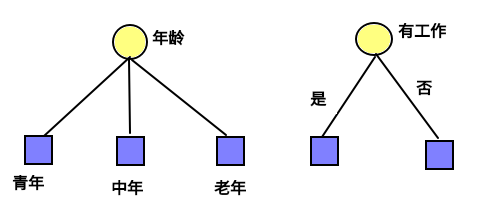
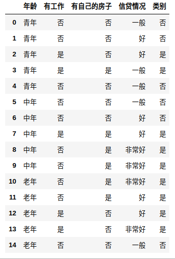

## 决策树

>**决策树定义：**分类决策树模型是一种描述实例进行分类的树形结构，决策树由节点和有向边组成，结点有两种类型：内部结点和叶结点。内部结点表示一个特征或属性，叶结点表示一个类。

**决策树示意图如下**：


​		其中，红色结点表示叶子结点（最终的分类情况），绿色节点表示分类的规则。决策树学习，是在给训练数据集的情况下，构建一个决策树模型，使它能够对实例进行正确的分类。而决策树的本质是从训练集中归纳出一组分类规则，与训练数据不相互矛盾的决策树（即能对训练数据进行正确分类的决策树）可能有多个，也可能一个也没有。<font color = #0099ff >我们需要的是一个与训练数据矛盾较小的决策树，同时具有横好的泛化能力</font>（对于未知数据的预测能力)。决策树的学习主要分为以下三个步骤：

### 1. 特征选择

>**目的：**如果利用一个特征进行分类的结果与随机分类的结果没有很大差别，则称这个特征是没有分类能力的。特征选择在于选取对训练数据具有分类能力的特征，这样能够提高决策树学习的效率。通常的选择标准为信息增益和信息增益比。

**信息增益**

> 问题描述：以下两个决策树都可以从此延续下去，那么究竟哪一个特征具有更好的分类能力，



>直观上如果一个特征具有更好的分类能力，或者说，按照这一特征将训练数据集分割成子集，使得各个自己在当前条件下有最好的分类，那么就选择这个特征。信息增益就能够很好的表示这一直观的准则。

**熵**：表示随机变量的不确定性的度量，公式如下：
$$
H(p)=H(X)=-\sum_{i=1}^{n} p_{i} \log p_{i}
$$
熵只与$X$的分布有关，与$X$取值无关，这句注意理解,定义$0\log0=0$，熵是非负的。

**条件熵：**

随机变量$(X,Y)$的联合概率分布为

$P(X=x_i,Y=y_j)=p_{ij}, i=1,2,\dots ,n;j=1,2,\dots ,m$

条件熵$H(Y|X)$表示在已知随机变量$X$的条件下随机变量$Y$的不确定性
$$
H(Y|X)=\sum_{i=1}^np_iH(Y|X=x_i)
$$
其中$p_i=P(X=x_i),i=1,2,\dots ,n$

**经验熵，经验条件熵：**当熵和条件熵中的概率由数据估计(特别是极大似然估计)得到时，所对应的熵与条件熵分别称为经验熵和经验条件熵，就是从已知的数据计算得到的结果。

**信息增益：**

特征$A$对训练数据集$D$的信息增益$g(D|A)$，定义为集合$D$的经验熵$H(D)$与特征$A$给定的条件下$D$的经验条件熵$H(D|A)$之差
$$
g(D,A)=H(D)-H(D|A)
$$

熵与条件熵的差称为互信息.

决策树中的信息增益等价于训练数据集中的类与特征的互信息。

考虑ID这种特征， 本身是唯一的。按照ID做划分， 得到的经验条件熵为0, 会得到最大的信息增益。所以， 按照信息增益的准则来选择特征， 可能会倾向于取值比较多的特征。

**例１：**

**<font color = #0099ff>数据集：</font>**

```python
import numpy as np
import pandas as pd
import matplotlib.pyplot as plt
%matplotlib inline

from sklearn.datasets import load_iris
from sklearn.model_selection import train_test_split
from collections import Counter
import math
from math import log
import pprint

# 书上题目5.1
def create_data():
    datasets = [['青年', '否', '否', '一般', '否'],
               ['青年', '否', '否', '好', '否'],
               ['青年', '是', '否', '好', '是'],
               ['青年', '是', '是', '一般', '是'],
               ['青年', '否', '否', '一般', '否'],
               ['中年', '否', '否', '一般', '否'],
               ['中年', '否', '否', '好', '否'],
               ['中年', '是', '是', '好', '是'],
               ['中年', '否', '是', '非常好', '是'],
               ['中年', '否', '是', '非常好', '是'],
               ['老年', '否', '是', '非常好', '是'],
               ['老年', '否', '是', '好', '是'],
               ['老年', '是', '否', '好', '是'],
               ['老年', '是', '否', '非常好', '是'],
               ['老年', '否', '否', '一般', '否'],
               ]
    labels = [u'年龄', u'有工作', u'有自己的房子', u'信贷情况', u'类别']
    # 返回数据集和每个维度的名称
    return datasets, labels
```

**<font color = #0099ff>原始数据：</font>**



<font color = #0099ff>数据处理代码:</font>

```python
import numpy as np
import pandas as pd
import matplotlib.pyplot as plt
%matplotlib inline

from sklearn.datasets import load_iris
from sklearn.model_selection import train_test_split
from collections import Counter
import math
from math import log
import pprint#头文件

#计算熵

def calc_ent(datasets):
    data_length = len(datasets)
    label_count = {}
    for i in range(data_length):
        label = datasets[i][-1]
        if label not in label_count:
            label_count[label] = 0
        label_count[label] += 1
    ent = -sum([(p / data_length) * log(p / data_length, 2)
                for p in label_count.values()])
    return ent

#计算经验条件熵
def cond_ent(datasets, axis=0):
    data_length = len(datasets)
    feature_sets = {}
    for i in range(data_length):
        feature = datasets[i][axis]#遍历每一行数据　以每一列特征为标准
        if feature not in feature_sets:
            feature_sets[feature] = []
        feature_sets[feature].append(datasets[i])#取得每一个子数据集
    cond_ent = sum(
        [(len(p) / data_length) * calc_ent(p) for p in feature_sets.values()])
    return cond_ent

#计算信息增益
def info_gain(ent, cond_ent):
    return ent - cond_ent

#遍历数据。计算第一次整体信息增益
def info_gain_train(datasets):
    count = len(datasets[0]) - 1 #总体的特征
    ent = calc_ent(datasets)
    
    best_feture = []
    
    for c in range(count):
        c_info_gain = info_gain(ent , cond_ent(datasets, axis = c))
        best_feture.append((c, c_info_gain))
        print("特征:%s, 信息增益%f" %(labels[c], c_info_gain))
        
    best_ = max(best_feture, key=lambda x : x[-1])
    
    return  '特征({})的信息增益最大，选择为根节点特征'.format(labels[best_[0]])
    
  
if __name__ == "__main__":
    datasets, labels = create_data()
    info_gain_train(np.array(datasets))
```

**<font color= #0099ff> 代码结果:</font>**

```python
特征:年龄, 信息增益0.085491
特征:有工作, 信息增益0.333333
特征:有自己的房子, 信息增益0.432538
特征:信贷情况, 信息增益0.373850
'特征(有自己的房子)的信息增益最大，选择为根节点特征'
```

**<font color= red>信息增益缺点：</font>**

以信息增益作为划分训练数据集的特征，存在偏向与选择取值比较多的特征的问题。使用信息增益比可以对这一问题进行校正，这也是特征选择的另一个准则。

**信息增益比：**
$$
\begin{array}{c}{g_{R}(D, A)=\frac{g(D, A)}{H_{A}(D)}} \\ {H_{A}(D)=-\sum_{i=1}^{n} \frac{D_{i}}{D} \log _{2} \frac{D_{i}}{D}}\end{array}
$$
### 2. 决策树的生成

#### ID3算法

> 输入：训练数据集$D$, 特征集$A$，阈值$\epsilon$
>
> 输出：决策树$T$
>
> 1. 如果$D$属于同一类$C_k$，$T$为单节点树，类$C_k$作为该节点的类标记，返回$T$
> 1. 如果$A$是空集，置$T$为单节点树，实例数最多的类作为该节点类标记，返回$T$（注：也即没有特征可以在划分）
> 1. 计算$g$, 选择信息增益最大的特征$A_g$
> 1. 如果$A_g$的信息增益小于$\epsilon$，$T$为单节点树，$D$中实例数最大的类$C_k$作为类标记，返回$T$
> 1. $A_g$划分若干非空子集$D_i$，
> 1. $D_i$训练集，<font color=red>$A-A_g$为特征集</font>，递归调用前面步骤，得到$T_i$，返回$T_i$(注：已经使用过的特征将不在继续下面结点的特征分裂)

**代码**：

```python
# 定义节点类 二叉树
class Node:
    def __init__(self, root=True, label=None, feature_name=None, feature=None):
        self.root = root
        self.label = label
        self.feature_name = feature_name
        self.feature = feature
        self.tree = {}
        self.result = {
            'label:': self.label,
            'feature': self.feature,
            'tree': self.tree
        }

    def __repr__(self):
        return '{}'.format(self.result)

    def add_node(self, val, node):
        self.tree[val] = node

    def predict(self, features):
        if self.root is True:
            return self.label
        return self.tree[features[self.feature]].predict(features)
        
class DTree:
    def __init__(self, epsilon=0.1):
        self.epsilon = epsilon
        self._tree = {}

    # 熵
    @staticmethod
    def calc_ent(datasets):
        data_length = len(datasets)
        label_count = {}
        for i in range(data_length):
            label = datasets[i][-1]
            if label not in label_count:
                label_count[label] = 0
            label_count[label] += 1
        ent = -sum([(p / data_length) * log(p / data_length, 2)
                    for p in label_count.values()])
        return ent

    # 经验条件熵
    def cond_ent(self, datasets, axis=0):
        data_length = len(datasets)
        feature_sets = {}
        for i in range(data_length):
            feature = datasets[i][axis]
            if feature not in feature_sets:
                feature_sets[feature] = []
            feature_sets[feature].append(datasets[i])
        cond_ent = sum([(len(p) / data_length) * self.calc_ent(p)
                        for p in feature_sets.values()])
        return cond_ent

    # 信息增益
    @staticmethod
    def info_gain(ent, cond_ent):
        return ent - cond_ent

    def info_gain_train(self, datasets):
        count = len(datasets[0]) - 1
        ent = self.calc_ent(datasets)
        best_feature = []
        for c in range(count):
            c_info_gain = self.info_gain(ent, self.cond_ent(datasets, axis=c))
            best_feature.append((c, c_info_gain))
        # 比较大小
        best_ = max(best_feature, key=lambda x: x[-1])
        return best_
    
    
    def train(self, train_data):
        """
        数据集的收集为pd
        """
        _, y_train, features = train_data.iloc[:,
                                               :-1], train_data.iloc[:,                                                     							-1],train_data.columns[:-1]
        
        #1.判断是否单个节点
        if len(y_train.value_counts()) == 1:
            return Node(root = True, label= y_train.iloc[0])
        #2.是否为空节点
        if len(features) == 0:
            return Node(root = True,
            label = y_train.value_counts().sort_values(
            ascending = False).index[0])

        #3.创建节点，选择信息增益最大的特征作为节点
        #3.１得到信息增益最大特征信息
        max_feature, max_info_gain = self.info_gain_train(np.array(train_data))
        max_feature_name = features[max_feature]
        
        #4.判断是否小于阀值
        if max_info_gain < self.epsilon:
            return Node(root = True,
                       label=y_train.value_counts().sort_values(
                       ascending=False).index[0])
        #5.构建Ag子集
        node_tree = Node(
            root=False, feature_name=max_feature_name, feature=max_feature)

        feature_list = train_data[max_feature_name].value_counts().index
        for f in feature_list:
            sub_train_df = train_data.loc[train_data[max_feature_name] ==
                                          f].drop([max_feature_name], axis=1)
        
            # 6, 递归生成树
            sub_tree = self.train(sub_train_df)
            node_tree.add_node(f, sub_tree)

        return node_tree
    
    def fit(self, train_data):
        self._tree = self.train(train_data)
        return self._tree
    def predict(self, X_test):
        return self._tree.predict(X_test)     
    
    
if __name__ == "__main__":
    datasets, labels = create_data()
    data_df = pd.DataFrame(datasets, columns=labels)
    dt = DTree()
    tree = dt.fit(data_df)
    print("tree:\n",tree)
    print("测试结果：", end="")
    print(dt.predict(["老年","否", "否", "一般"]))
```

**ID3算法结果**：

```
tree:
{'label:': None, 'feature': 2, 'tree': {'否': {'label:': None, 'feature': 1, 'tree': {'否': {'label:': '否', 'feature': None, 'tree': {}}, '是': {'label:': '是', 'feature': None, 'tree': {}}}}, '是': {'label:': '是', 'feature': None, 'tree': {}}}}
测试结果：
'否'
```

**ID3算法缺点**：

ID3算法只有树的生成，所以该算法生成的树容易过拟合。

#### C4.5 算法

> 输入：训练数据集$D$, 特征集$A$，阈值$\epsilon$
> 输出：决策树$T$
>
> 1. 如果$D$属于同一类$C_k$，$T$为单节点树，类$C_k$作为该节点的类标记，返回$T$
> 2. 如果$A$是空集, 置$T$为单节点树，实例数最多的作为该节点类标记，返回$T$
>    1. 计算$g$, 选择**<font color = red>信息增益比</font>**最大的特征$A_g$
> 1. 如果$A_g$的**<font color = red>信息增益比</font>**小于$\epsilon$，$T$为单节点树，$D$中实例数最大的类$C_k$作为类标记，返回$T$
> 1. $A_g$划分若干非空子集$D_i$，
> 1. $D_i$训练集，$A-A_g$为特征集，递归调用前面步骤，得到$T_i$，返回$T_i$
> <font color=black>**Tip: ID3和C4.5在生成上，差异只在准则的差异。**</font>

**C4.5 算法代码：**

```python
# 定义节点类 二叉树
class Node:
    def __init__(self, root=True, label=None, feature_name=None, feature=None):
        self.root = root
        self.label = label
        self.feature_name = feature_name
        self.feature = feature
        self.tree = {}
        self.result = {
            'label:': self.label,
            'feature': self.feature,
            'tree': self.tree
        }

    def __repr__(self):
        return '{}'.format(self.result)

    def add_node(self, val, node):
        self.tree[val] = node

    def predict(self, features):
        if self.root is True:
            return self.label
        return self.tree[features[self.feature]].predict(features)

class DTree:
    def __init__(self, epsilon=0.1):
        self.epsilon = epsilon
        self._tree = {}

    # 熵
    @staticmethod
    def calc_ent(datasets):
        data_length = len(datasets)
        label_count = {}
        for i in range(data_length):
            label = datasets[i][-1]
            if label not in label_count:
                label_count[label] = 0
            label_count[label] += 1
        ent = -sum([(p / data_length) * log(p / data_length, 2)
                    for p in label_count.values()])
        return ent

    # 经验条件熵
    def cond_ent(self, datasets, axis=0):
        data_length = len(datasets)
        feature_sets = {}
        for i in range(data_length):
            feature = datasets[i][axis]
            if feature not in feature_sets:
                feature_sets[feature] = []
            feature_sets[feature].append(datasets[i])
        cond_ent = sum([(len(p) / data_length) * self.calc_ent(p)
                        for p in feature_sets.values()])
        # 划分特征的信息熵（信息增益比的分母）
        sub_ent = -sum([len(p) / data_length * log(len(p)/data_length
                                                  ,2) for p in feature_sets.values()])
        return cond_ent, sub_ent

    # 信息增益
    @staticmethod
    def info_gain(ent, cond_ent, sub_ent):
        return (ent - cond_ent)/sub_ent

    def info_gain_train(self, datasets):
        count = len(datasets[0]) - 1
        ent = self.calc_ent(datasets)
        best_feature = []
        for c in range(count):
            print(c)
            cond_ent, sub_ent = self.cond_ent(datasets, axis=c)
            c_info_gain = self.info_gain(ent, cond_ent, sub_ent)
            best_feature.append((c, c_info_gain))
            print("特征:%s, 信息增益%f" %(labels[c], c_info_gain))
        # 比较大小
        best_ = max(best_feature, key=lambda x: x[-1])
        
        return best_
    
    
    def train(self, train_data):
        """
        数据集的收集为pd
        """
        _, y_train, features = train_data.iloc[:,
                                               :-1], train_data.iloc[:,
                                                                 -1],train_data.columns[:-1]
        
        #1.判断是否单个节点
        if len(y_train.value_counts()) == 1:
            return Node(root = True, label= y_train.iloc[0])
        
        #2.是否为空节点
        if len(features) == 0:
            return Node(root = True,
            label = y_train.value_counts().sort_values(
            ascending = False).index[0])
       
        #3.创建节点，选择信息增益最大的特征作为节点
        #3.１得到信息增益最大特征信息
        max_feature, max_info_gain = self.info_gain_train(np.array(train_data))
        max_feature_name = features[max_feature]
        
        #4.判断是否小于阀值
        if max_info_gain < self.epsilon:
            return Node(root = True,
                       label=y_train.value_counts().sort_values(
                       ascending=False).index[0])
        #5.构建Ag子集
        node_tree = Node(
            root=False, feature_name=max_feature_name, feature=max_feature)

        feature_list = train_data[max_feature_name].value_counts().index
        print("feature_list :",feature_list)
        for f in feature_list:
            sub_train_df = train_data.loc[train_data[max_feature_name] ==
                                          f].drop([max_feature_name], axis=1)
        
            # 6, 递归生成树
            sub_tree = self.train(sub_train_df)
            node_tree.add_node(f, sub_tree)

        return node_tree
    
    def fit(self, train_data):
        self._tree = self.train(train_data)
        return self._tree
    def predict(self, X_test):
        return self._tree.predict(X_test)
    
    
    if __name__ == "__main__":
    datasets, labels = create_data()
    data_df = pd.DataFrame(datasets, columns=labels)
    dt = DTree()
    tree = dt.fit(data_df)
    print("tree:\n",tree)
    print("测试结果：")
    dt.predict(["老年","否", "否", "一般"])
```

### 3.决策树的剪枝

>目的：由决策树算法生成的决策树，往往对于**训练数据**的分类很准确，但是对于**未知的测试数据**的分类却没有那么准确，即出现过拟合，过拟合的原因在于学习时过多的考虑如何提高训练数据的正确分类，从而构建过于复杂的决策树，所以要考虑决策树的复杂度，对已生成的决策树进行简化。而通常决策树的剪枝往往是通过减少损失函数来体现的。如下：
>
>​		树$T$的叶结点个数为$|T|$，$t$是树$T$的叶结点，该结点有$N_t$个样本点，其中$k$类的样本点有$N_{tk}$个，$H_t(T)$为叶结点$t$上的经验熵， $\alpha\geqslant 0$为参数，决策树学习的损失函数可以定义为
>$$
>C_\alpha(T)=\sum_{i=1}^{|T|}N_tH_t(T)+\alpha|T|
>$$
>其中
>$$
>H_t(T)=-\sum_k\color{red}\frac{N_{tk}}{N_t}\color{black}\log \frac{N_{tk}}{N_t}
>$$
>
>$$
>C(T)=\sum_{t=1}^{|T|}\color{red}N_tH_t(T)\color{black}=-\sum_{t=1}^{|T|}\sum_{k=1}^K\color{red}N_{tk}\color{black}\log\frac{N_{tk}}{N_t}
>$$
>
>这时有
>$$
>C_\alpha(T)=C(T)+\alpha|T|
>$$
>其中$C(T)$表示模型对训练数据的误差，$|T|$表示模型复杂度，参数$\alpha \geqslant 0$控制两者之间的影响。

**算法描述：**

>输入：生成算法生成的整个树$T$，参数$\alpha$
>
>输出：修剪后的子树$T_\alpha$
>
>1. $ \alpha(T_A)\leqslant C_\alpha(T_B)$计算每个结点的经验熵
>2. 递归的从树的叶结点向上回缩
>   假设一组叶结点回缩到其父结点之前与之后的整体树分别是$T_B$和$T_A$，其对应的损失函数分别是$C_\alpha(T_A)$和$C_\alpha(T_B)$，如果$C_\alpha(T_A)\leqslant C_\alpha(T_B)$则进行剪枝，即将父结点变为新的叶结点
>3. 返回2，直至不能继续为止，得到损失函数最小的子树$T_\alpha$

## CART（重点）

### 回归树

#### 算法描述

输入：训练数据集$D$

输出：回归树$f(x)$

步骤：

1. 遍历变量$j$，对固定的切分变量$j$扫描切分点$s$，得到满足上面关系的$(j,s)$
   $$
   \min\limits_{j,s}\left[\min\limits_{c_1}\sum\limits_{x_i\in R_1(j,s)}(y_i-c_1)^2+\min\limits_{c_2}\sum\limits_{x_i\in R_2(j,s)}(y_i-c_2)^2\right]
   $$

1. 用选定的$(j,s)$, 划分区域并决定相应的输出值
   $$
   R_1(j,s)=\{x|x^{(j)}\leq s\}, R_2(j,s)=\{x|x^{(j)}> s\} \\
   \hat{c}_m= \frac{1}{N}\sum\limits_{x_i\in R_m(j,s)} y_j, x\in R_m, m=1,2
   $$

1. 对两个子区域调用(1)(2)步骤， 直至满足停止条件
1. 将输入空间划分为$M$个区域$R_1, R_2,\dots,R_M$，生成决策树：
   $$
   f(x)=\sum_{m=1}^M\hat{c}_mI(x\in R_m)
   $$

**代码**：

```python
from numpy import *


def loadDataset():
    """加载本地数据"""
    
    dataset = []
    f = open("regData.txt")
    fr = f.readlines()
    for line in fr:
        line = line.strip().split("\t")
        linef = [float(li) for li in line]
        dataset.append(linef)
#         print(dataset)
    dataSetMat = mat(dataset)
    
    return dataSetMat

def calcErr(dataSetMat):
    
    error = var(dataSetMat[:,-1])*shape(dataSetMat)[0]
    return error

def chooseBestFeatureval2split(dataSetMat):
    """选择分类节点"""
    
    # 如果预测值相同
    if(len(set(dataSetMat[:, -1].T.tolist()[0])) == 1): return None, None
    
    bestFeature = 0
    bestValue = 0
    lowestErr = 100000
    totalErr = calcErr(dataSetMat)
    
    #  遍历特征
    for feature in range(shape(dataSetMat)[1] - 1):
        allValues = [d[feature] for d in dataSetMat.tolist()]
        values = set(allValues)  #每一个维度的特征
        for value in values:
            leftChild, rightChild = splitByFeatVal(feature, value, dataSetMat)
            if(shape(leftChild)[0] == 0 or shape(rightChild)[0] == 0): continue
            curErr = calcErr(leftChild) + calcErr(rightChild)
            if (curErr < lowestErr):
                bestFeature = feature
                bestValue = value
                lowestErr = curErr
        
    if (totalErr - lowestErr < 1): return None, None # 防止过拟合，并且作为递归的终止条件
    
    return bestFeature, bestValue

def splitByFeatVal(feature, value, dataSetMat):
    """分裂节点"""
    
    leftChild = dataSetMat[nonzero(dataSetMat[:, feature] > value)[0],:]
    rightChild = dataSetMat[nonzero(dataSetMat[:, feature] <= value)[0],:]
    
    return leftChild, rightChild

def createRegTree(dataSetMat):
    """创建回归树"""
    
    feature, value = chooseBestFeatureval2split(dataSetMat)
    
    if feature == None: return mean(dataSetMat[:, -1])#返回最终的预测结果
    
    regTree = {}
    regTree["feature"] = feature
    regTree["value"] = value
    leftChild, rightChild = splitByFeatVal(feature, value, dataSetMat)
    regTree["leftChild"] = createRegTree(leftChild)
    regTree["rightChild"] = createRegTree(rightChild)
    
    return regTree

if __name__ == "__main__":
    dataSetMat = loadDataset()
    regTree = createRegTree(dataSetMat)
    print(regTree)
```

### 分类树

#### 算法描述

>分类树用基尼指数选择最优特征，同时决定该特征的最优二值切分点。

**基尼指数：**分类问题中，假设有$K$个类，样本点属于第$K$类的概率为$p_k$,则概率分布的基尼指数定义为：
$$
Gini(p) = \sum_{k=1}^Kp_k(1-p_k)=1-\sum_{k=1}^Kp_k^2
$$
**分类树算法描述：**

>输入: 训练数据集D,停止计算条件
>
>输出：CART 分类树
>
>1 训练数据集为$D$,计算现有特征对训练数据集的基尼指数，此时对于每一个特征A,对其可能取得每一个值a，根据此值将训练样本切分为$D1$和$D2$两部分，然后根据上式计算A=a基尼指数
>$$
>\operatorname{Gini}(D, A)=\frac{|D 1|}{|D|} \operatorname{Gini}(D 1)+\frac{|D 2|}{|D|} \operatorname{Gini}(D 2)
>$$
>2 在所有可能的特征以及所有可能的值里面选择基尼指数最小的特征及其切分点作为最优的特征及切分点，从结点生成两个子结点，将训练数据集分配到子结点中去
>
>3 递归的调用1 2 直到满足停止的条件
>
>4 生成分类决策树

**代码**

```PYTHON
from numpy import *

def loadDataSet():
    """加载数据"""

    dataSet = [[0, 0, 0],
               [0, 1, 1],
               [0, 2, 0],
               [1, 0, 1],
               [1, 1, 1],
               [1, 2, 1],
               [2, 0, 0],
               [2, 1, 1],
               [2, 2, 0]]
    labels = ['color','shape']
    return dataSet, labels

def calcGini(dataSet):
    """计算基尼指数"""
    
    totalNum = shape(dataSet)[0]
    
    labelNum = {}
    gini = 0
    
    for data in dataSet:
        label = data[-1]
        if label in labelNum:
            labelNum[label] += 1
        else:
            labelNum[label] = 1
            
    for key in labelNum:
        p = labelNum[key]/ totalNum
        gini += p*(1-p)
        
    return gini

def chooseBestFeatVal2Split(dataSet):
    """选择最优切分点"""
    
    # 1.如果没有切分的变量
    if(len(dataSet[0]) == 1): 
        print("dfadfafa")
        return None, None
    
    # 2.所有的目标变量的相等
    if(len(set([d[-1] for d in dataSet])) == 1): 

        return None, None
    
    # 3.寻找最佳切分点
    bestfeatur = 0
    bestValue = 0
    lowestGini = 1000000
    totalGini = calcGini(dataSet)
    totalNum = shape(dataSet)[0]
    
    # 4.遍历特征
    for feature in range(shape(dataSet)[1] - 1):
        allValues = [d[feature] for d in dataSet]
        values = set(allValues)
        
        # 5.遍历每个特征所可能要取的值
        for value in values:
            leftChild, rightChild = splitByFeature(feature, value, dataSet)
            # 6.如果左子树或右子树无节点
            if(shape(leftChild)[0] == 0 or shape(rightChild)[0] == 0): return None, None
            
            # ７．计算划分后的基尼指数
            leftNum = shape(leftChild)[0]
            rightNum = shape(rightChild)[0]
            
            curGini = leftNum/totalNum *calcGini(leftChild) + rightNum/totalNum*calcGini(rightChild)
            
            if (curGini < lowestGini):
                bestfeatur = feature
                bestValue = value
                lowestGini = curGini
    
    if(totalNum - lowestGini < 0.00001): return None, None
    
    return bestfeatur, bestValue

def splitByFeature(feature, value, dataSet):
    
    dataSet = mat(dataSet)
    leftChild = dataSet[nonzero(dataSet[:, feature] == value)[0],:].tolist()
    rightChild = dataSet[nonzero(dataSet[:, feature] != value)[0],:].tolist()
    
    return leftChild, rightChild

def checkIsOneCateg(newDataSet):
    """是否划分节点是唯一的节点"""

    flag = False
    categList = [data[-1] for data in newDataSet]
    
    category = set(categList)
    if len(category) == 1:
         flag = True
    
    return flag

def  majorityCateg(newDataSet):
    """主要的类别"""
    
    categCount = {}
    categList = [data[-1] for data in newDataSet]
    
    for c in categList:
        if c not in  categCount:
            categCount[c] = 1
            
        else:
            categCount[c] += 1
            
    sortedCateg = sorted(categCount.item(), key=lambda x:x[1], reverse=True)
    
    return sortedCateg

def createClassifTree(dataSet):
    """创建分类树"""
    
    feature, value = chooseBestFeatVal2Split(dataSet)
    
    if feature == None and checkIsOneCateg(dataSet):
        return dataSet[0][-1]
    
    if feature == None and not checkIsOneCateg:
        return majorityCateg(dataSet)
    
    classifTree = {}
    classifTree["featIndex"] = feature
    classifTree["value"] = value
    leftChild, rightChild = splitByFeature(feature, value, dataSet)
    classifTree["leftChild"] = createClassifTree(leftChild)
    classifTree["rightChild"] = createClassifTree(rightChild)
    
    
    return classifTree
    
if __name__ == '__main__':
    dataSet, labels = loadDataSet()
    classifTree = createClassifTree(dataSet)
    print(classifTree)
```

**CART剪枝**

>输入：CART算法生成的决策树T0
>
>输出： 最优的决策树Ta
>
>1 设k=0,T=T0
>
>2 设=Na（正无穷）
>
>3自下而上的对内部结点t进行计算C(Tt),|Tt|和g(t)=，=min(,g(t))
>
>4 对g(t)=的内部结点进行剪枝，并对叶结点t以多数表决法决定其类，得到树T
>
>5 设k=k+1,k=，Tk=T
>
>6 如果Tk不是由根结点及两个叶结点构成的树，回到步骤3,否则另<u>Tk=Tn</u>


### 参考

[机器学习之手把手实现](https://www.ibm.com/developerworks/cn/analytics/library/machine-learning-hands-on1-svn/index.html?ca=drs-)

[信息熵 条件熵 信息增益 信息增益比 GINI系数](https://blog.csdn.net/bitcarmanlee/article/details/51488204)

[决策树中的熵、条件熵、信息增益和Gini指数计算示例](决策树中的熵、条件熵、信息增益和Gini指数计算示例)